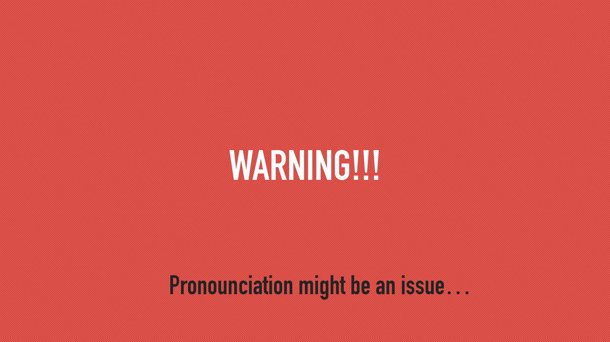
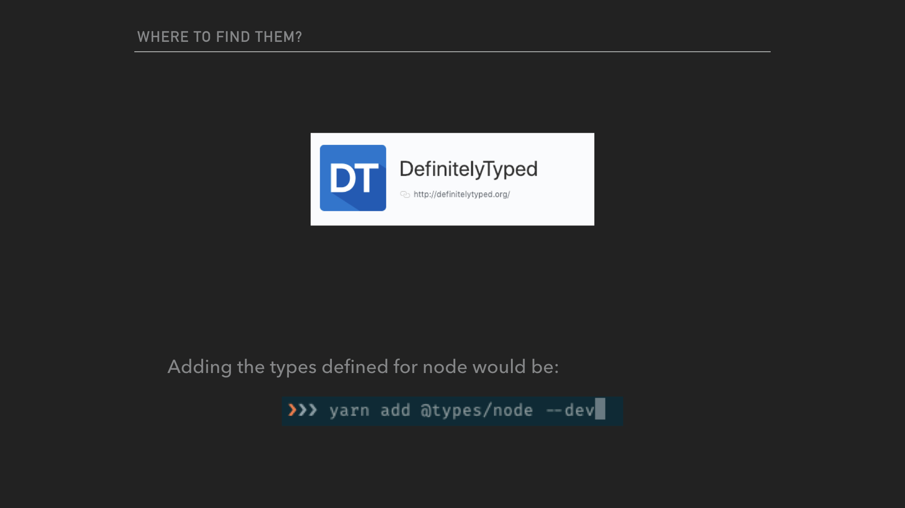

# Define the world as your oyster (presentation)
## Slide 1

## Slide 2

## Slide 3

## Slide 4

## Slide 5

## Slide 6

## Slide 7

## Slide 8

## Slide 9

## Slide 10

## Slide 11

## Slide 12

## Slide 13

## Slide 14

## Slide 15

## Slide 16

## Slide 17

## Slide 18

## Slide 19

## Slide 20

## Slide 21

## Slide 22

## Slide 23

## Slide 24

## Slide 25

## Slide 26

## Slide 27

## Slide 28

## Slide 29

## Slide 30

## Slide 31

## Slide 32

## Slide 33

## Slide 34

## Slide 35

## Slide 36

## Slide 37

## Slide 38

## Slide 39

## Slide 40

## Slide 41

## Slide 42

## Slide 43

## Slide 44

